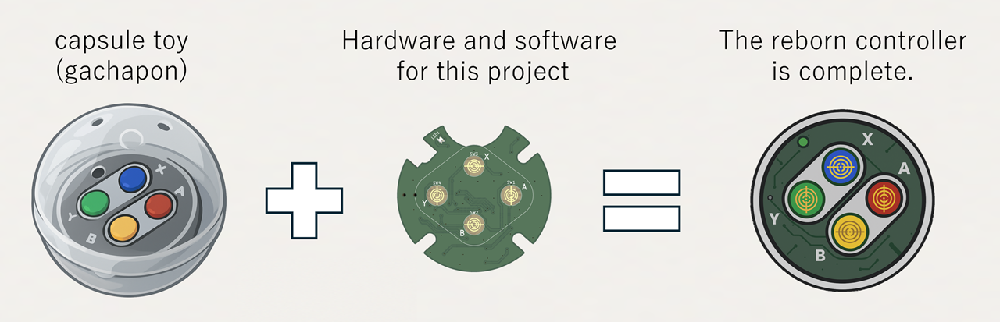
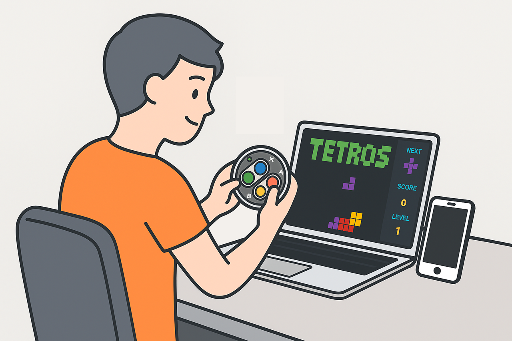
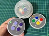
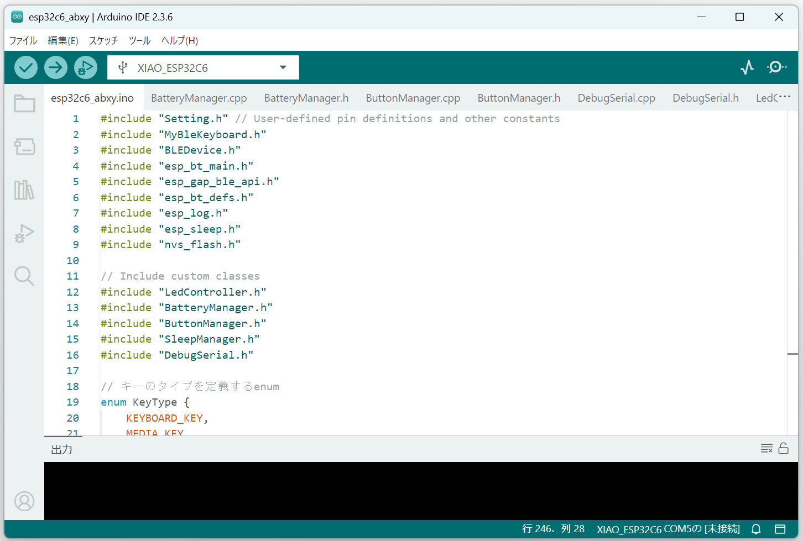
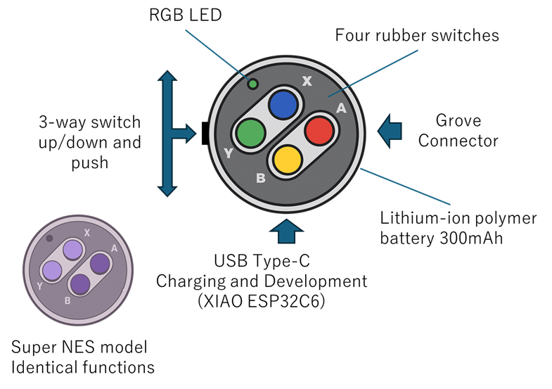

# ABXY-buttons (English)

This project aims to connect a Super Nintendo-style four-button controller, released as a capsule toy (Controller Button Collection 2) in 2024, to a PC (Windows/Mac) or smartphone (iPhone/Android) as a Bluetooth wireless HID device.

*Note: Super Famicom and Super Nintendo Entertainment System are trademarks of Nintendo.*

## Project Background
If you're interested in the origin and motivation behind this project, please see [PROJECT_BACKGROUND.en.md](./document/PROJECT_BACKGROUND.en.md).

## Design Materials
The available design resources are listed below. 

| Category | Description | Link |
|----------|-------------|------|
| Hardware | Circuit Diagram | [SF_SNES_ABXY_BUTTON.pdf](./hardware/SF_SNES_ABXY_BUTTON.pdf) |
| Hardware | Bill of Materials | [BOM_list.pdf](./hardware/BOM_list.pdf) |
| Hardware | PCB Image | [boaud_image.png](./hardware/boaud_image.png) |
| 3D Model | Inner Case Lid | [ABXY-Inner.stl](./3d-model/ABXY-Inner.stl) |
| 3D Model | LED Alignment Tool | [LED-3mmPoint.stl](./3d-model/LED-3mmPoint.stl) |
| Software | Source Code | [esp32c6_abxy](./source/esp32c6_abxy/) |

## Documents
| Description | Image | Document (click to open) | Summary |
|-------------|--------|---------------------------|---------|
|Development Environment||[MY_DEVELOPMENT_ENVIRONMENT.en.md](./document/MY_DEVELOPMENT_ENVIRONMENT.en.md)|Describes the development environment used for this project.|
|How to Make||[MAKE.en.md](./document/MAKE.en.md)|Step-by-step instructions for assembling the device.|
|Software Build||[SOFTWARE_BUILD.en.md](./document/SOFTWARE_BUILD.en.md)|Development is done using the Arduino IDE environment.|
|How to Use||[HOW_TO_USE.en.md](./document/HOW_TO_USE.en.md)|Explains the device’s features and how to operate it.|
|Q&A||[Q_AND_A.en.md](./document/Q_AND_A.en.md)|Frequently asked questions and answers.|

[Back](README.md)
