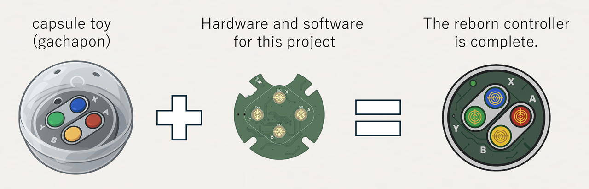
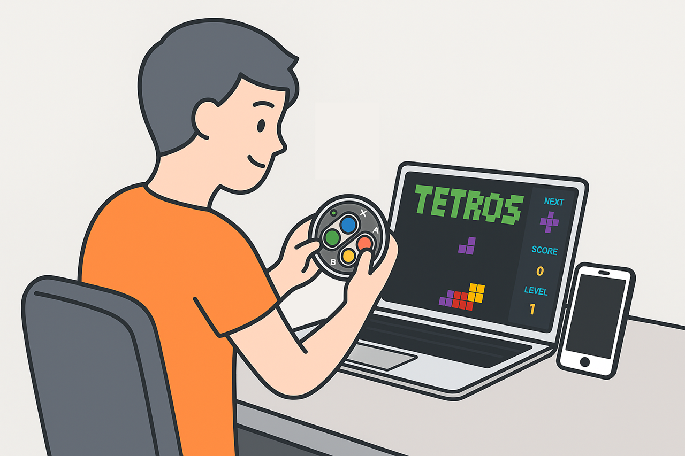
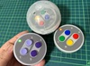
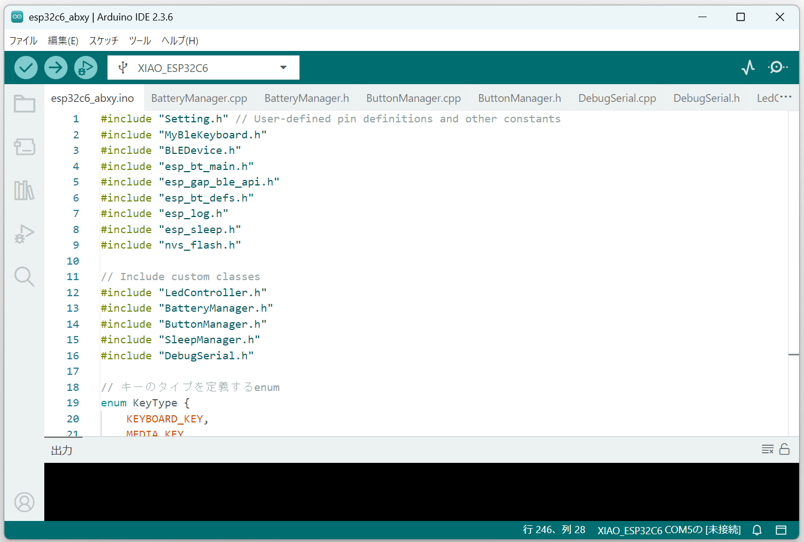

# ABXY-buttons（日本語）

このプロジェクトは、2024年にカプセルトイ（Controller Button Collection 2）として発売されたスーパーファミコン風の4ボタンコントローラーを、BluetoothワイヤレスHIDデバイスとしてPC（Windows/Mac）やスマートフォン（iPhone/Android）に接続することを目的としています。

※スーパーファミコン、Super Nintendo Entertainment Systemは、任天堂の商標です。

## プロジェクトの背景
もしプロジェクトを立ち上げた経緯などに、ご興味があればご覧ください。[PROJECT_BACKGROUND.ja.md](./document/PROJECT_BACKGROUND.ja.md)参照

## 設計資料
公開している設計資料は、以下となります。 

| カテゴリー | 内容 | リンク |
|--------|--------|--------|
| ハードウェア | 回路図 | [SF_SNES_ABXY_BUTTON.pdf](./hardware/SF_SNES_ABXY_BUTTON.pdf) |
| ハードウェア | 部品表 | [BOM_list.pdf](./hardware/BOM_list.pdf) |
| ハードウェア | 基板 | [boaud_image.png](./hardware/boaud_image.png) |
| 3Dデータ | ケース内蓋 | [ABXY-Inner.stl](./3d-model/ABXY-Inner.stl) |
| 3Dデータ | LED位置合わせ用 | [LED-3mmPoint.stl](./3d-model/LED-3mmPoint.stl) |
| ソフトウェア | ソースコード | [esp32c6_abxy](./source/esp32c6_abxy/) |

## ドキュメント
| 内容 | イメージ | ドキュメント名(クリックで開きます) | 概要 |
|--------|--------|--------|--------|
|個人開発環境||[MY_DEVELOPMENT_ENVIRONMENT.ja.md](./document/MY_DEVELOPMENT_ENVIRONMENT.ja.md)|今回のプロジェクトで利用した開発環境を示します。|
|作り方||[MAKE.ja.md](./document/MAKE.ja.md)|作るための手順を示します。|
|ソフトウェアビルド方法||[SOFTWARE_BUILD.ja.md](./document/SOFTWARE_BUILD.ja.md)|Arduino IDE環境を使い開発しています。|
|使い方||[HOW_TO_USE.ja.md](./document/HOW_TO_USE.ja.md)|作ったデバイスの機能や操作方法を解説します。|
|Q&A||[Q_AND_A.ja.md](./document/Q_AND_A.ja.md)|よくある質問と回答を示します。|

[戻る](README.md)
