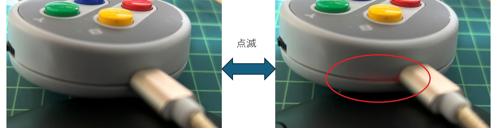

## How to Use

The following describes the behavior of the device with the default firmware. If the firmware is modified, the behavior may differ.

### Device Overview

The main unit has 7 physical switches for operation:

| Operation | Sent Key | Description |
|----------|----------|-------------|
| A | KEY_RIGHT_ARROW | Right arrow key |
| B | KEY_DOWN_ARROW | Down arrow key |
| X | KEY_UP_ARROW | Up arrow key |
| Y | KEY_LEFT_ARROW | Left arrow key |
| UP | KEY_MEDIA_VOLUME_UP | Volume up |
| DOWN | KEY_MEDIA_VOLUME_DOWN | Volume down |
| PUSH | None | Long press (1 sec) to power off |

### RGB LED Indication

| LED Status | Description | Notes |
|------------|-------------|-------|
| Red | Not connected (including unpaired) | - |
| Green | Connected | - |
| Blinking | Battery level below 25% | Red or green blinking |
| Fast Blinking | Waiting for pairing info clear | Execute by pressing A button |
| Yellow | Clearing pairing info | - |

### Power Control

| Power | Description | Notes |
|-------|-------------|-------|
| ON | Press any ABXY button | - |
| OFF | Long press PUSH for 1 second | - |

### USB Charging

Charging can be done via a USB Type-C cable. By default, a 300mAh lithium-ion polymer battery is used, and it may take up to about 180 minutes to fully charge. During charging, the red LED on the XIAO board (left of the USB port) will blink. This light is faint and only slightly visible near the connector, so please look carefully. If the LED is not blinking, it is fully charged.  
*According to the XIAO ESP32C6 specifications, the charging current is limited to 120mA.*

You can place your hand over the device to shade the light slightly and make the blinking more visible.

### Pairing

When using the device for the first time, pairing is required. Make sure the RGB LED on the device is red (powered on) before pairing. If it is off, press any of the ABXY buttons to turn on the power.

Pairing methods vary depending on the OS, so detailed instructions are not provided here. However, you should be able to see a device named **"SF/SNES A,B,X,Y Button"** as a keyboard when searching for new devices. Select it and complete the pairing process.  
Once paired, the device remembers the pairing information, so you can reconnect automatically without re-pairing.

| Device | Pairing Procedure | Notes |
|--------|-------------------|-------|
| Windows 11 | Settings → Bluetooth & devices → Add device | - |
| macOS | System Settings → Bluetooth → Nearby Devices | Press any button if asked to input a key |
| iPhone | Settings → Bluetooth → Other Devices | - |
| Android | Settings → Connected Devices → Pair New Device | - |

Confirmed to work on:  
- Windows 11 Pro (24H2)  
- macOS Ventura (13.7.6)  
- iPhone 14 (iOS 18.5)  
- Selected Android models  

Please note: Compatibility has not been confirmed for all devices.

[Back](../README.en.md)

