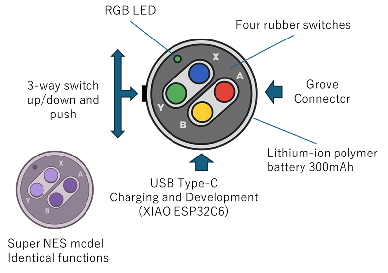

## 使い方
初期ファームでの動作説明になります。プログラムを変更した場合の動作は異なります。

### 本体の説明

本体には、操作部として以下の7か所のスイッチがあります。
| 操作 | 送信キー | 説明 |
|--------|--------|--------|
| A | KEY_RIGHT_ARROW | 右矢印キー |
| B | KEY_DOWN_ARROW | 下矢印キー |
| X | KEY_UP_ARROW | 上矢印キー |
| Y | KEY_LEFT_ARROW | 左矢印キー |
| UP | KEY_MEDIA_VOLUME_UP | 音量UPキー |
| DOWN | KEY_MEDIA_VOLUME_DOWN | 音量DOWNキー |
| PUSH | なし | １秒長押しで電源OFF |

### RGB LEDの表示
| LED状態 | 説明 | 備考 |
|--------|--------|--------|
| 赤 | 未接続（未ペアリング含む） | - |
| 緑 | 接続中 | - |
| 点滅 | 電源 25%以下 | 赤点滅／緑点滅あり |
| 高速点滅 | ペアリング情報クリア待ち | Aボタンで実行|
| 黄 | ペアリング情報クリア中 | - |

### 電源操作
| 電源 | 説明 | 備考 |
|--------|--------|--------|
| ON | ABXYのいづれかを押下 | - |
| OFF | PUSHを１秒長押し | - |

### USB充電
USB Type-Cケーブルで充電が行えます。標準では、300mAhのリチウムイオンポリマー電池を利用しており、満充電まで最大180分程度要します。充電中は、XIAO本体の赤LED（USB端子の左側）が点滅します。コネクタ横から、明かりがうっすらと漏れる程度ですので、注意してください。点滅してない場合は、満充電となります。 
※XIAO ESP32C6の仕様で充電電流は120mAとされています。

手をかざして、照明を少し遮るとうっすらと点滅状態がわかります。

### ペアリング
はじめて利用する際には、ペアリングを実施します。ペアリングの際は、本体のRGBLEDが赤（電源ON）であることを確認してください。消灯している場合には、ABXYいづれかのボタンを押して起動させてください。
各OS毎にペアリング方法は異なるのでここで詳細は説明しませんが、デバイスの追加を行う画面で、キーボードとして「SF/SNES A,B,X,Y Button」のデバイスが見えるはずなので、選択しペアリングさせてください。一度ペアリングを行ったデバイスは、そのペアリング情報を保持しますので、その後は再ペアリングせずに利用することが可能です。

| 機種 | ペアリング手順 | 備考 |
|--------|--------|--------|
| Windows11 | 設定->Bluetoothとデバイス->デバイスの追加 | - |
| macOS | システム設定->Bluetooth->近くのデバイス | キー入力を求められたら任意のボタンを押す |
| iPhone | 設定->Bluetooth->その他のデバイス | - |
| Android | 設定->機器接続->新しい機器とペア設定する | - |

当方では、Windows11 Pro(24H2), macOS Ventura(13.7.6), iPhone14(iOS18.5), Androidの一部機種で接続できることを確認しています。すべての機種で動作が確認できた訳ではありませんのでご注意ください。

[戻る](../README.ja.md)