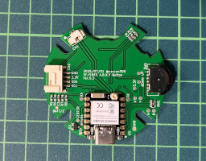
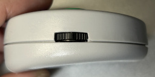
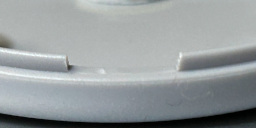

## Assembly Instructions

To build the device, you’ll need to gather the required tools and parts, and modify parts of the four-button case.

### Required Tools

| Image | Tool | Purpose | Notes |
|-------|------|---------|-------|
|  | Small Phillips screwdriver | Fastening the case screws | - |
|  | 3mm hand drill | Drilling the LED opening | - |
|  | Precision knife | Modifying the case | - |
|  | Work gloves | Preventing injury while using the knife | - |

### Required Parts

| Image | Name | Description | Notes |
|--------|------|-------------|-------|
|  | (A1) 4-button case | Either SF or SNES version | Obtain from flea markets, as the gacha sale has ended |
|  | (A2) Assembled PCB | Created from design files | - |
|  | (A3) Inner lid for PCB | 3D printed | [ABXY-Inner.stl](./3d-model/ABXY-Inner.stl) |
|  | (A4) LED alignment plate | 3D printed | [LED-3mmPoint.stl](./3d-model/ABXY-Inner.stl) |
|  | (A5) Lithium-ion polymer battery | Fits inside the case (35x20x5mm) | 300mAh |
|  | (A6) Clear soft plastic rod (3mm) | Used to extend LED light | Cut to 6mm length |
|  | (A7) USB Type-C cable | For charging and programming | - |
|  | (A8) Cushion seal | Prevents battery from rattling | Optional if not needed |

### Disassembling the Case

Remove the four screws. Inside, there is a plastic inner lid, but it will not be used for this build. The ball chain should also be temporarily removed as it gets in the way during assembly. All other parts, including the four screws, will be reused, so take care not to lose them. The rubber switch is prone to attracting dust, so handle it carefully.

| Image | Part Name | Notes |
|--------|-----------|--------|
|  | (B1) Top case | Requires modification |
|  | (B2) Bottom case | Requires modification |
|  | (B3) Original inner lid | Not used |
|  | (B4) Rubber switch | Handle carefully to avoid dust contamination |
|  | (B5) Buttons (4 pieces) | - |
|  | (B6) Screws (4 pieces) | Small—easy to lose |
|  | (B7) Ball chain | Remove for the assembly process |

### Work Overview

The build process involves modifications to three main areas of the case, followed by final assembly.  
Please take care when using knives or other sharp tools to avoid injury.

| Image | Task |
|--------|------|
|  | 1. Modify the slide switch area |
|  | 2. Modify the USB connector opening |
|  | 3. Drill the LED window |
|  | 4. Cut the clear plastic rod |
|  | 5. Final assembly |

### 1. Modifying the Slide Switch Area

| Image | Description |
|-------|-------------|
|  | When fitting the (A2) assembled PCB into the unmodified (B1) top case, the slide switch will interfere, preventing it from seating properly. The goal is to trim this area so the PCB fits cleanly. The length of the area to be removed is about 12 mm, as indicated by the red dashed lines in the image. Mark two points where the dashed line intersects with the (B1) top case using a knife. |
|  | In the photo, the upper case in the top row is unmodified, while the lower row shows it after modification. Using the marks you made earlier, slowly shave away material to a depth of about 3 mm. |
|  | As a guide, 3 mm depth is where the surface of the slide switch becomes level with the top edge of the case when the (A2) assembled PCB is inserted into the (B1) top case (see red dashed line).  **Note:** When checking fit, be sure to also insert the (B4) rubber switch, as the rubber's thickness must be accounted for. |
|  | Fit the (B2) bottom case to the (B1) top case and mark the cutting position on the bottom case. As before, trim the (B2) bottom case to the same depth. |
|  | The depth to cut here is about 1.4 mm — just the interlocking portion of the case. Compared to the top case modification, this is thinner and easier to work with. |
|  | Completed modification. |

### 2. Modifying the USB Connector Opening

| Image | Description |
|-------|-------------|
|  | The USB opening modification process is similar to the slide switch modification above. Fit the (A2) assembled PCB into the (B1) top case, and mark two points that extend from the USB connector position. The distance is about 9 mm. |
|  | The cutting depth is about 2.5 mm. |
|  | Unlike the slide switch modification, the USB connector will not be flush with the case surface. Check the depth while working, together with the modification on the (B2) bottom case. |
|  | Fit the (B2) bottom case to the (B1) top case and mark the cutting position on the bottom case. As before, cut the (B2) bottom case to the same depth. |
|  | The cutting depth here is about 1.4 mm — just the interlocking portion of the case. |
|  | Completed modification. |

### 3. Modifying the LED Window

| Image | Description |
|-------|-------------|
|  | Drill a 3 mm hole in the (B1) top case to allow the LED light from the PCB to be visible from the outside. The hole must be aligned with the LED position on the PCB, so use the (A4) LED alignment plate as shown in the photo to avoid misalignment. The small protrusion should be visible at the upper left. |
|  | Use a 3 mm hand drill to make the hole. Do not force the drill through in one go — proceed gradually, clearing away shavings as you work. |
|  | Just before breaking through, you will encounter a decorative film layer about 0.5 mm thick that differs from the main material. Drill through it slowly to ensure a clean finish. |

*Once the hole is complete, the (A4) LED alignment plate is no longer needed.*

### 4. Cutting the Clear Plastic Rod

| Image | Description |
|-------|-------------|
|  | Cut the (A6) clear soft plastic rod (3 mm diameter) to a length of about 6 mm. Being slightly shorter is not an issue, but if it is too long, it will protrude from the (B1) top case, so adjust accordingly. |

### 5. Assembly

| Image | Description |
|-------|-------------|
|  | Insert the 6 mm cut (A6) clear plastic rod into the LED hole drilled earlier in the (B1) top case. Since it’s a 3 mm rod through a 3 mm hole, it will be a tight fit — adjust as necessary. Ensure it is flush with the case surface so it doesn’t protrude. |
|  | Insert the (B5) buttons (4 pieces) into the (B1) top case. |
|  | Place the (B4) rubber switch over the buttons. There is no top/bottom orientation for this part. |
|  | Fit the (A2) assembled PCB into the (B1) top case. The fit around the top-right LED position may be tight, so adjust if necessary. Likewise, if the USB or slide switch openings are insufficiently trimmed, shave them further as needed. |
|  | Pass the connector of the (A5) lithium-ion polymer battery through the open section of the (A3) PCB inner lid. |
|  | Connect the battery connector to the receiving connector on the (A2) assembled PCB. Ensure correct orientation. The LED will light red — long press the slide switch for 1 second to turn the power OFF (LED off). Route the cable as shown in the photo, behind the round section, to avoid pinching and breaking the wire.  **Note:** Even when the LED is off, the device is still in low-power mode, so avoid dropping metal objects (like screws) onto it. |
|  | Attach the (A8) cushion seal (with one side still covered) to the underside of the central upper post of the (B2) bottom case. This helps prevent battery movement. If rattling becomes an issue later, you can fully stick it in place. The example in the photo uses it with the adhesive side still covered. |
|  | Finally, align everything carefully and fasten with the four screws. The fit should be precise, but if the halves do not align well, check for interference — common issues are insufficient trimming of the USB or slide switch openings, preventing the PCB from seating properly. Rework as needed. Done! |

For instructions on how to use the device, see [HOW_TO_USE.en.md](../document/HOW_TO_USE.en.md).

[Back](../README.en.md)
