## 作り方
作るためには、必要な工具や部品を揃え、4つボタンのケースを一部加工する必要があります。

### 必要な工具

| イメージ | 工具 | 用途 | 備考 |
| --------|--------|--------|--------|
| 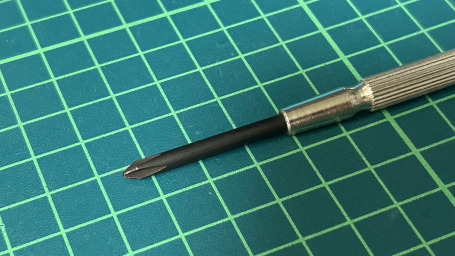| 小型プラスドライバー | ケースねじ止め | - |
| 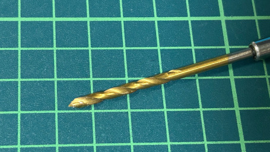| 3㎜ハンドドリル | LED表示部穴あけ | - |
| | デザインナイフ | ケース加工 | - |
| | 作業用手袋 | ナイフで手を切らないように | - |

### 必要な部品一覧

| イメージ| 名称 | 説明 | 備考 |
|--------|--------|--------|--------|
|| (A1)4ボタンケース | SF/SNESのどちらか | ガチャ販売終了のためフリマサイト等で調達 |
|| (A2)実装済み基板 | 設計資料で作成する | - |
|| (A3)基板用内蓋 | 3Dプリンターで作成する | [ABXY-Inner.stl](./3d-model/ABXY-Inner.stl) |
|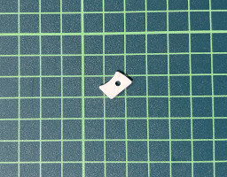| (A4)LED位置合わせプレート | 3Dプリンターで作成する |  [LED-3mmPoint.stl](./3d-model/ABXY-Inner.stl) |
|| (A5)リチウムイオンポリマー電池 | ケースに収まるサイズ(35x20x5mm) |  300mAh |
|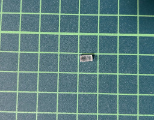| (A6)透明ソフトプラ材（丸棒3mm）| LED光延長 | 長さは6㎜にカットして利用 |
|| (A7)USB Type-Cケーブル | 充電、プログラム用 | - |
|| (A8)クッションシール | 電池のがたつき防止 | 気にならなければ不要 |

### ケース分解
4か所ねじ止めされているので外します。外すと、プラスチックの内蓋がありますが、それは今回利用しません。ボールチェーンは、組み立て時に邪魔なので、ひとまず外しておきます。それ以外の部品は4つのネジを含めてすべて利用するので、なくさないように注意しましょう。ラバースイッチのゴムは、ほこり等が付着しやすいので、注意して扱います。

| イメージ | 名称 | コメント |
| --------|--------|--------|
| |(B1)ケース表|加工が必要です。|
| |(B2)ケース裏|加工が必要です。|
| |(B3)内蓋|利用しません|
| 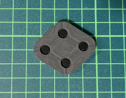|(B4)ラバースイッチ|塵・ほこりの付着注意|
| 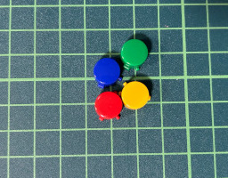|(B5)ボタン(4つ)|ー|
| |(B6)ネジ（4本）|小さいので紛失注意|
| 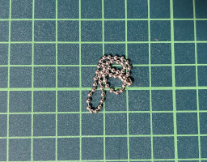|(B7)ボールチェーン|完成まで外してください|

### 作業の概要
大きく分けて3か所のケース加工と最後に組み立てが必要になります。ナイフ等でケガをしないように注意して作業してください。

| イメージ | 加工 |
| --------|--------|
||1.上下スライドスイッチの操作部の加工|
||2.USBコネクタの抜き差し部の加工|
|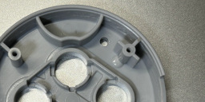|3.LED表示部の加工|
|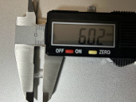|4.透明ソフトプラ材カット|
||5.組み立て|

### 1.上下スライドスイッチの操作部の加工
| イメージ | 説明 |
| --------|--------|
||未加工の(B1)ケース表に、(A2)実装済み基板をはめ込んでみると、このスイッチがぶつかりまだしっかり入りません。この部分をうまく加工し基板がきれいに入るようにするのが目標です。写真にあるスイッチ本体の面を延長した部分（赤の点線）の長さ(赤の<->分)が約12mmですので、この範囲がカットしたい幅となります。点線と(B1)ケース表が交わる２か所をナイフでマークしておきます|
|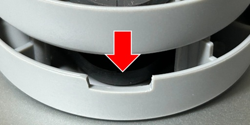|写真は、未加工の(B1)ケース表が上段で、下段が加工済みのものになります。先ほどナイフで加工範囲をマークしましたが、その範囲を一定の深さ（3mm）までゆっくり削っていきます。|
||3mmの目安としては、(A2)実装済み基板を(B1)ケース表入れた状態で、ケースの高さとスイッチの面が水平になる位置です。（写真の赤点線ライン） ※(A2)実装済み基板を入れて確認する際は、(B4)ラバースイッチも入れて確認してください。ゴムの厚み分を考慮する必要があります。|
|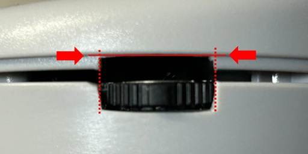|(B1)ケース表に、(B2)ケース裏を合わせて、加工位置をマークします。先ほどと同様に(B2)ケース裏も一定の深さまで加工します。|
||深さは写真にあるように、ケースのかみ合わせ部分の1.4mmだけ削ります。先ほどの加工に比べると、薄いので加工しやすいです。|
||完成。|

### 2.USBコネクタの抜き差し部の加工
| イメージ | 説明 |
| --------|--------|
|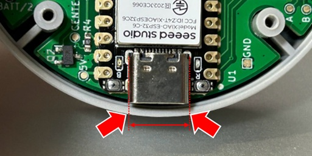|USBの加工も、先の1.上下スライドスイッチの操作部の加工と同様の作業となります。 (B1)ケース表に、(A2)実装済み基板をはめ込み、USBのコネクタ部分を延長した位置2か所をマークします。約9mmとなります。|
||加工の深さは、約2.5mmです。|
||1.上下スライドスイッチの操作部の加工とは異なり、USBコネクタとフラットな高さとはなりませんので注意してください。下の(B2)ケース裏の加工と合わせて深さを確認しながら作業してください。|
||(B1)ケース表に、(B2)ケース裏を合わせて、加工位置をマークします。先ほどと同様に(B2)ケース裏も一定の深さまで加工します。|
||深さは写真にあるように、ケースのかみ合わせ部分の1.4mmだけ削ります。|
||完成。|

### 3.LED表示部の加工
| イメージ | 説明 |
| --------|--------|
||基板上のLED光をケース外に透過させるための直径3mm穴を、(B1)ケース表にあけます。基板のLED位置と合わせる必要があるので、穴あけ位置がずれないように、(A4)LED位置合わせプレートを写真の位置に置きます。左上に小さな突起が見えるようにします。|
||3mmハンドドリルで穴を貫通させます。一気に貫通させるのではなく、様子をみながら削りカスを除去して穴あけします。|
||貫通直前には、素材が異なる0.5mm程度の化粧フィルムが貼り付けられているので、そこをゆっくり穴あけしないと綺麗な加工となりませんので注意します。|

※穴あけが完了すれば、(A4)LED位置合わせプレートは不要となります。

### 4.透明ソフトプラ材カット
| イメージ | 説明 |
| --------|--------|
||(A6)透明ソフトプラ材（丸棒3mm）を長さ約6mmでカットします。多少短い分には問題になることはありませんが長いと、(B1)ケース表から出てしまうのでそこは微調整してください。|

### 5.組み立て

| イメージ | 説明 |
| --------|--------|
||先ほどLED穴をあけた、(B1)ケース表の穴に、6mmでカットした、(A6)透明ソフトプラ材を入れます。3mm穴に3mm棒を通すので少しきついですが、調整しながら入れます。表への出っ張りがないように面を合わせるようにします。 |
||(B1)ケース表に、(B5)ボタン（4つ）を入れます。 |
||(B1)ケース表に、(B4)ラバースイッチでカバーします。上下に方向はないようです。 |
|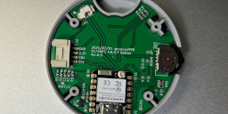|(B1)ケース表に、(A2)実装済み基板を合わせます。右上のLEDの場所のはまり具合がきつい場合があるので、その場合は調整してください。また、USB穴や、スライドスイッチの削りがあまい場合も微調整して削るようにします。 |
|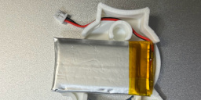|(A3)基板用内蓋の穴があいてる部分に、(A5)リチウムイオンポリマー電池のコネクタを通します。 |
|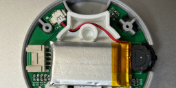|(A2)実装済み基板のコネクタ受け側に、コネクタを差し込みます。上下方向があるので合わせます。LEDが赤く点灯するので、スライドスイッチを長押し（1秒）して電源をOFF（LEDが消灯）します。配線もはさまれて断線しないように写真のように、丸い部分のうしろを通すようにしておきます。 ※LEDが消灯しても低消費電力モードで動作していますので、この状態で金属片（ネジ等）を落としたりしないように注意してください。 |
|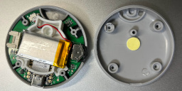|(B2)ケース裏の中央上部の支柱の真下辺りに、(A8)クッションシールを片面ははがさずに貼り付けます。これは、(A5)リチウムイオンポリマー電池のがたつき防止用です。今後、がたつきが気になるようであれば、シールで貼り付けてしまうとよいと思います。私は、写真のように片面ははがさずに利用しています。|
||最後にうまく合わせこんで、4か所ねじ止めすれば完成です。寸法としては綺麗に収まるサイズになっていますので、もし綺麗にかみ合わない場合は、位置を確認してください。ありがちなのは、USBやスライドスイッチの加工が不十分で、基板がしっかりとはまらないケースが考えられます。その場合は、再加工してください。そして、完成です！ |

本体の使い方、操作方法については、[HOW_TO_USE.ja.md](../document/HOW_TO_USE.ja.md)を参照してください。

[戻る](../README.ja.md)

