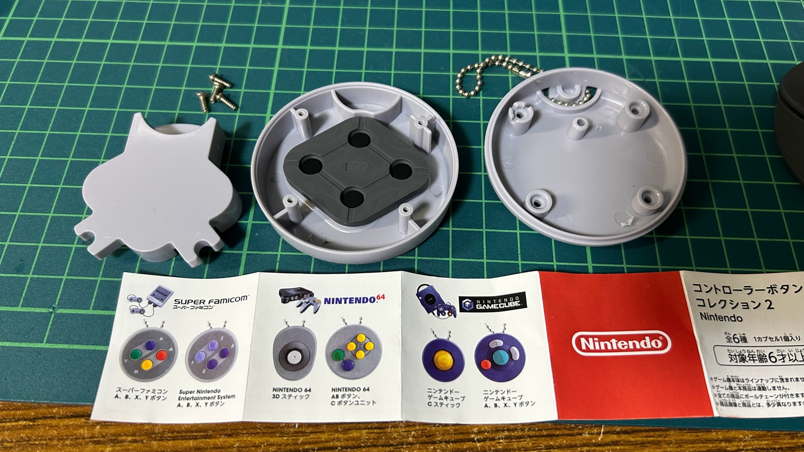

## Project Background

When I first picked up this toy, I was surprised by its build quality.  
It was clear that care had been taken not only in its appearance but also in the feel of the button presses.  

When I removed the case screws, I found that it used what appeared to be genuine contact rubber switches inside.  
At the center of each rubber switch, conductive contact pads were even present.  
Since this is a toy, the contact surface of the pads was made of plastic, so of course they did not actually conduct electricity.  

Seeing this, I felt as if I had received a challenge from the toy’s creators — and decided to launch a project to give this capsule toy a new life.  
 
*Note:* By giving new life to toys (keychains) that have finished their role and would otherwise be discarded, this project also contributes to the SDGs (albeit as an afterthought).

The toy was released by Nintendo Co., Ltd. and manufactured by Bandai Co., Ltd.

In the center of the image, you can see the diamond-shaped contact rubber switch.  
On the left is a strangely shaped plastic piece that receives the rubber switch, but it does not transmit any actual signal when pressed.

This toy (Controller Button Collection 2) includes six different controllers.  
This project currently supports the two shown on the left side of the booklet in the photo.

## Another Reason

In fact, I had previously created a keyboard called [2x2Key](https://www.facebook.com/2x2key/).  
With only four keys, users often struggled to find enough use cases.  
This time, based on that experience, I decided to start by expanding its potential through gaming and similar applications.

[Back](../README.en.md)
