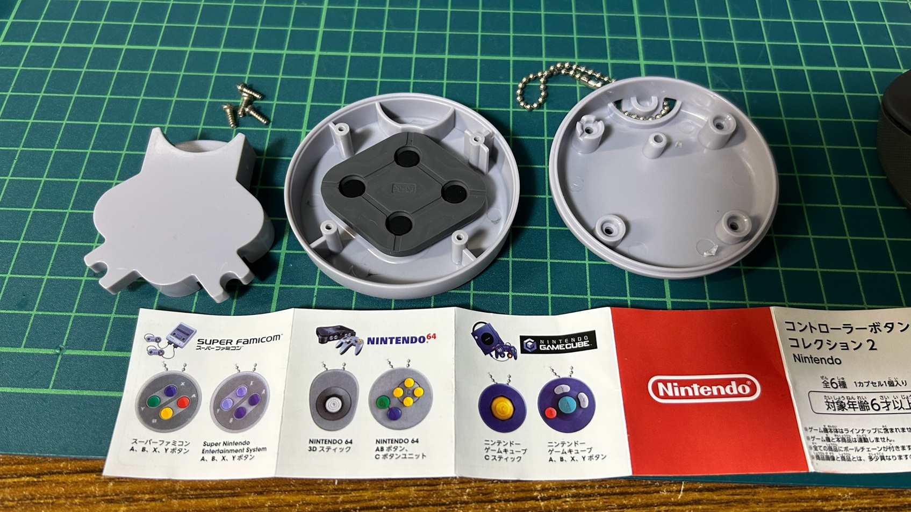

## プロジェクトの背景
私は、この玩具を手に取ったとき、作りこみのクオリティに驚きました。見た目だけでなく、ボタンの押し心地にも、こだわって作られているのは明らかでした。
ケースのねじを外すと、中からは本物と同じであろうコンタクトラバースイッチが利用されていました。
そして、ラバースイッチの中央には、導電性の接点ゴムまで利用されています。玩具であるため接点ゴムの接触面はプラスチックであり、もちろん通電する訳ではありません。
これを見て私は、玩具製作者からの挑戦状であろうと考え、このガチャに命を与えるプロジェクトを立ち上げることにした。 
※玩具（キーホルダー）としての役目を終え、廃棄されることになる玩具に新たな命を与えることでSDGsにも貢献します。（後付けに近いが・・・）

玩具の発売元は任天堂株式会社、製造元はバンダイ株式会社です。

画像中央に、ひし形のコンタクトラバースイッチが見える。画像左の変な形のものがそのラバースイッチを受け取るプラスチック樹脂であり、押された信号を受け取る訳ではない。

この玩具（コントローラボタンコレクション2）には、6種類のコントローラーがある。今回サポートしているのは、写真の冊子の左側2つです。

## もう一つの理由

じつは、過去に[2x2Key](https://www.facebook.com/2x2key/)というキーボードを作っていた。4つしかないキーの用途を見つけるのに、利用者も困惑していた。今回は、その経験も踏まえて、まずはゲーム等の用途から裾野を増やすことを考えました。

[戻る](../README.ja.md)
