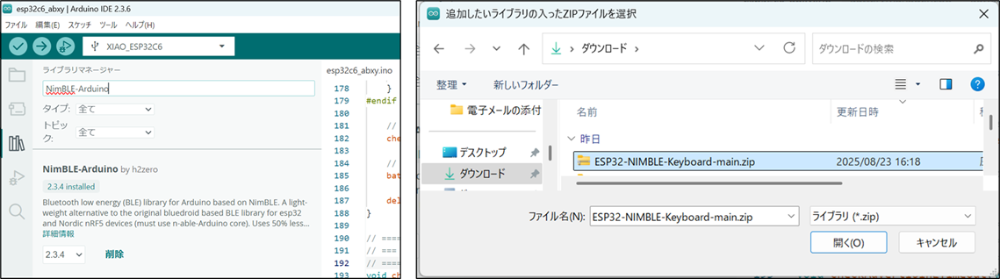
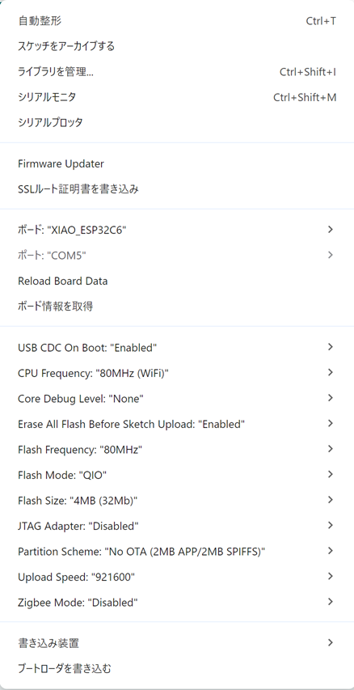
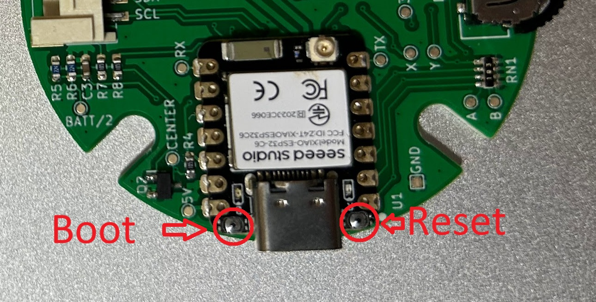

## Build Instructions
The ESP32 and BLE libraries are frequently updated, and using different versions may cause errors. Please be careful when using versions other than the ones listed below.  
The environment I used is as follows:

- [Arduino IDE 2.3.6](https://www.arduino.cc/en/software/)  
- Board Manager: [esp32 by Espressif Systems 3.3.0](https://github.com/espressif/arduino-esp32)  
- BLE library: [NimBLE-Arduino by h2zero 2.3.4](https://github.com/h2zero/NimBLE-Arduino)  
- Keyboard library: [ESP32-NIMBLE-Keyboard](https://github.com/Berg0162/ESP32-NIMBLE-Keyboard)  

### Prerequisites
This guide assumes that Arduino IDE is installed and that the **XIAO ESP32C6** board is available in your environment.  
If this is your first time setting up the board, please refer to [Seeed Studio’s official guide](https://wiki.seeedstudio.com/xiao_esp32c6_getting_started/).  

### Installing Libraries
You need to install two libraries:  

1. Open the Arduino Library Manager, search for **“NimBLE-Arduino”**, and install version **2.3.4** (see image on the left).  
2. Download [ESP32-NIMBLE-Keyboard](https://github.com/Berg0162/ESP32-NIMBLE-Keyboard) as a ZIP file and add it to Arduino.  

  

### Arduino IDE Settings
In the **Tools** menu, set the following:

| Setting Name | Value | Notes |
|--------------|-------|-------|
| Board | XIAO_ESP32C6 | - |
| Port | COM X | Adjust according to your environment |
| CPU Frequency | 80MHz (WiFi) | Works at 160MHz as well |
| Core Debug Level | None | - |
| Erase All Flash Before Sketch Upload | Enabled | Clears bonding information |
| Flash Frequency | 80MHz | - |
| Flash Mode | QIO | - |
| Flash Size | 4MB (32Mb) | - |
| JTAG Adapter | Disabled | - |
| Partition Scheme | No OTA (2MB APP / 2MB SPIFFS) | OTA not used currently |
| Upload Speed | 921600 | - |
| Zigbee Mode | Disabled | - |

### Build
Download the [source code](./source/esp32c6_abxy/) from the design documents,  
open `esp32c6_abxy.ino` in Arduino IDE, and build.  
If a build error occurs, check for version mismatches — especially in the Board Manager version.  
*Note: ESP32 is updated frequently, so version mismatches are common.*

### Upload
Upload via USB.  
If uploading fails or the serial port is not visible, start the XIAO ESP32C6 in Bootloader mode:  
Hold down the **Boot** button and press **Reset** (ON → OFF).  
The Boot button is to the left of the USB port, and the Reset button is to the right.  
These are very small switches, so handle them carefully.  

If the device is still in its case, you will need to remove the four screws before performing this procedure.

[Back](../README.en.md)
