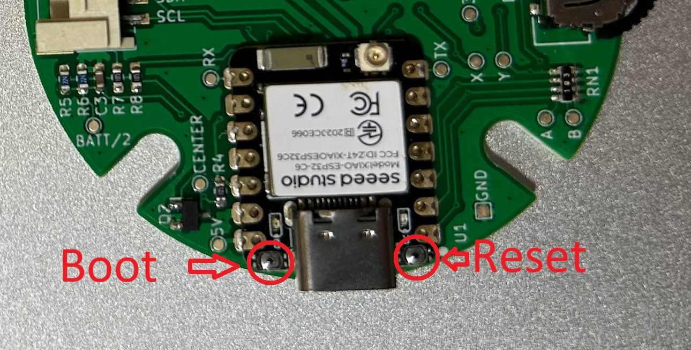

## ビルド方法
ESP32やBLEのライブラリは更新が頻繁にあるので、Versionが異なるとエラーが発生することがあります。異なるVersionを利用する際には注意してください。私は以下のものを利用しています。
- [Arduino IDE 2.3.6](https://www.arduino.cc/en/software/)
- ボードマネージャー [esp32 by Espressif Systems 3.3.0](https://github.com/espressif/arduino-esp32)
- BLEライブラリ [NimBLE-Arduino by h2zero 2.3.6](https://github.com/h2zero/NimBLE-Arduino)
- キーボードライブラリ [ESP32-NIMBLE-Keyboard](https://github.com/Berg0162/ESP32-NIMBLE-Keyboard)
- ゲームパッドライブラリ[ESP32-BLE-Gamepad](https://github.com/lemmingDev/ESP32-BLE-Gamepad)

### 前提条件
Arduino IDEインストールと、XIAO ESP32C6のボードが利用できている状態とします。
もし、はじめて利用する場合には、[Seeed Studioの公式ブログ](https://wiki.seeedstudio.com/xiao_esp32c6_getting_started/)を参考に構築してください。

### ライブラリのインストール
ライブラリを2つインストールします。
- 最初に、Arduinoのライブラリマネージャーで、"NimBLE-Arduino"を検索すると表示されますので、2.3.6版をインストールします。（画像左）
- 次に、[ESP32-NIMBLE-Keyboard](https://github.com/Berg0162/ESP32-NIMBLE-Keyboard)をzipダウンロードして追加します。
- もしゲームパッドとして利用する場合には、[ESP32-BLE-Gamepad](https://github.com/lemmingDev/ESP32-BLE-Gamepad)をzipダウンロードして追加します。


### Arduno IDEの設定
「メニュー」の「ツール」で下記の設定に合わせる。
| 項目名 | 設定内容 | 備考 |
|--------|--------|--------|
| ボード | XIAO_ESP32C6 | - |
| ポート | COM X | お使いの環境に合わせて設定 |
| CPU Frequency | 80MHz(WiFi) | 160MHzでも動作可能 |
| Core Debug Level | None | - |
| Erase All Flash Before Sketch Upload | Enabled | ボンド情報はクリアされる |
| Flash Frequency | 80MHz | - |
| Flash Mode | QIO | - |
| Flash Size | 4MB(32Mb) | - |
| JTAG Adapter | Disabled | - |
| Partition Scheme | No OTA (2MB APP/2MB SPIFFS) | 現在OTAは利用しない |
| Upload Speed | 921600 | - |
| Zigbee Mode | Disabled | - |


### ビルド
設計資料にある[ソースコード](./source/esp32c6_abxy/)をダウンロードし、Arduino IDEでesp32c6_abxy.inoを開きます。
もし、ゲームパッドとして利用する場合には、Setting.hのIS_GAME_CONTROLLERを1に変更します。デフォルトは0でキーボードとなっています。
```cpp
// If you are using it as a keyboard, set it to 0;
// if you are using it as a game controller, set it to 1.
#define IS_GAME_CONTROLLER              (1)
```
次にビルドします。もし、ビルドエラーが発生する場合には、Versionの違いに注意してください。とくにボードマネージャーのVersionの違いに注意してください。<br>
※ESP32は頻繁に更新されるため違いが発生しやすいです。

### 書き込み
USB経由で書き込みます。もし、うまく書き込みができない場合やシリアルポートが見えない場合には、XIAO ESP32C6をBootLoaderモードで起動させます。手順は、Bootボタンを押したまま、ResetボタンをON->OFFします。Bootボタンは、USB端子の左側にあり、Resetボタンは端子の右側です。非常に小さいスイッチなのでうまく操作してください。<br>
もし、ケースに入れたままの状態の場合は、4か所のねじを外して作業する必要があります。



[戻る](../README.ja.md)